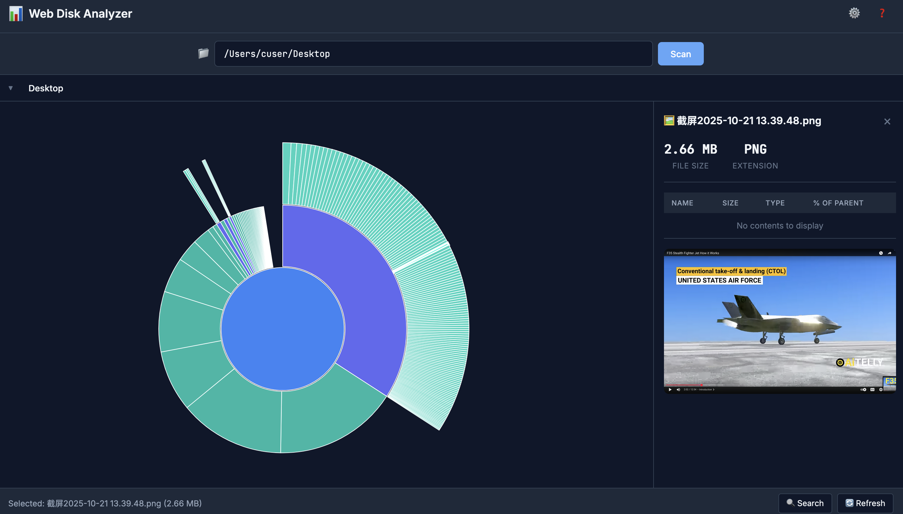

# Web Disk Usage Analyzer

A web-based hierarchical disk usage analysis tool inspired by DaisyDisk. Visualizes disk usage as an interactive multi-ring sunburst chart.



## Features

- **Interactive Sunburst Chart**: Multi-ring pie chart showing directory hierarchy
- **Drill-down Navigation**: Click segments to explore subdirectories
- **Fast Scanning**: Efficient file system traversal with caching
- **Configurable**: Exclude patterns, depth limits, path restrictions
- **Web-based**: Access from any browser, no installation needed
- **Keyboard Shortcuts**: Full keyboard navigation support

## Quick Start

### Backend

```bash
cd backend
pip install -r requirements.txt
python main.py
```

Server runs at http://localhost:8000

### Frontend

The frontend is served automatically by the backend. Open http://localhost:8000 in your browser.

For development with hot reload:

```bash
cd frontend
python -m http.server 3000
# Then update api/client.js baseUrl to 'http://localhost:8000'
```

## Project Structure

```
melon/
├── backend/           # FastAPI backend
│   ├── main.py       # API server
│   ├── scanner.py    # File system scanner
│   ├── models.py     # Pydantic models
│   ├── test_api.py   # API tests (29 tests)
│   ├── test_backend.py # Scanner tests (3 tests)
│   └── requirements.txt
├── frontend/          # Web UI
│   ├── index.html    # Main page
│   ├── app.js        # Application entry
│   ├── chart.js      # D3 sunburst visualization
│   ├── api/
│   │   └── client.js # Backend API client
│   ├── utils/
│   │   └── transform.js # Data utilities
│   ├── ui/
│   │   ├── breadcrumb.js
│   │   ├── details-panel.js
│   │   └── tooltip.js
│   └── styles/
│       └── main.css
├── .hermes/plans/    # Implementation plans
└── README.md
```

## Backend API

### Endpoints

| Endpoint | Description |
|----------|-------------|
| `GET /health` | Health check |
| `GET /api/config` | Server configuration |
| `GET /api/scan?path=/dir` | Scan directory |
| `GET /api/children?parent_id=N` | Get children (lazy load) |
| `GET /api/search?query=txt&root=/dir` | Search nodes |
| `DELETE /api/cache` | Clear scan cache |

### Example Usage

```bash
# Scan a directory
curl "http://localhost:8000/api/scan?path=/Users/cuser/Documents"

# Get config
curl "http://localhost:8000/api/config"

# Search for Python files
curl "http://localhost:8000/api/search?query=.py&root=/Users/cuser"
```

### Configuration

Environment variables:

| Variable | Default | Description |
|----------|---------|-------------|
| `ALLOWED_PATHS` | `~/,/Volumes` | Allowed root paths |
| `EXCLUDED_PATTERNS` | `.git,node_modules,...` | Patterns to exclude |
| `MAX_DEPTH` | `50` | Max scan depth |
| `MAX_RESULTS` | `100000` | Max nodes to return |

## Frontend

### Keyboard Shortcuts

| Shortcut | Action |
|----------|--------|
| `Ctrl+O` | Focus path input |
| `Ctrl+F` | Open search |
| `Ctrl+R` | Refresh scan |
| `Escape` | Close panel / Clear selection |
| `Backspace` | Go up one level |
| `0` | Reset zoom |
| `?` | Show help |

### Chart Interactions

- **Click segment**: Drill down into directory
- **Click inner ring**: Navigate up
- **Hover**: Show tooltip with details
- **Double-click**: Reset zoom
- **Scroll**: Zoom in/out
- **Drag**: Rotate chart

## Data Format

Scan results use a compact flat array format:

```json
{
  "root": "/Users/cuser/Documents",
  "nodes": [
    {"id": 0, "parent_id": null, "name": "Documents", "size": 1073741824, "depth": 0, "is_dir": true},
    {"id": 1, "parent_id": 0, "name": "github", "size": 536870912, "depth": 1, "is_dir": true}
  ],
  "total_size": 1073741824,
  "total_files": 150,
  "total_dirs": 25,
  "scan_time_ms": 234.5
}
```

Benefits:
- No path repetition (saves 80%+ space vs nested JSON)
- Easy to reconstruct tree for any node
- Efficient for compression

## Testing

### Backend Tests

```bash
cd backend
pytest -v

# With coverage
pytest --cov=. --cov-report=html
```

32 tests covering:
- All API endpoints
- Scanner functionality
- Error handling
- Performance

## Development

### Running Tests

```bash
# Backend
cd backend && pytest -v

# Frontend (manual)
# Open frontend/index.html in browser
```

### Code Style

- Python: Follow PEP 8
- JavaScript: ES6+ modules, async/await
- CSS: BEM-like naming, CSS variables

## License

MIT
